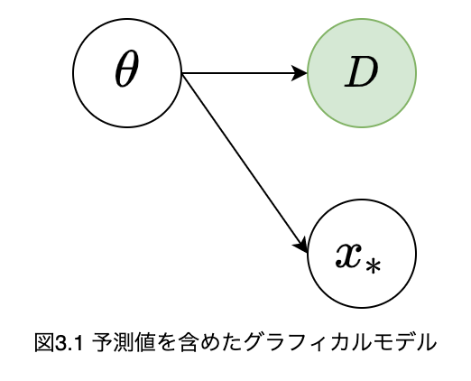

<!-- _class: title -->

<h1> ベイズ推論による機械学習入門 </h1>

 

<h2> ベイズ推論による学習と予測(3.1-3.2) </h2>

2022/5/11
情報理工学科 竹川修平

---

<!-- _class: mokuji -->
<h1> 目次 </h1>
 第3章 ベイズ推論による学習と予測 (3.1-3.2) 

 

    <ul>
        <li> 3.1 学習と予測  3  </li> 
        
 

        <li> 3.2 離散確率分布の学習と予測  11  </li>
    </ul>

---
<!-- header: 3.1 学習と予測 -->
<!-- _class: section_title -->
<h1> 3.1 学習と予測 </h1>

---
<!-- class: card -->

<h1> 学習と予測 </h1>
<ul>
    <li>
    一般的に機械学習の分野では, モデルの持つパラメータの値をデータから決定することを<b>学習 (training, learning)</b>という.
    </li>
    <li>
    ベイズ推論の枠組みでは, パラメータも不確実性を伴う確率変数として扱うので, 確率計算によってデータを観測した後のパラメータの事後分布を求めることが<b>学習</b>にあたる. 
    </li>
    <li>
    多くの場合では単純にパラメータを得るだけでなく, まだ観測されていない値に関する予測を行うことも主要な課題になる.  予測分布に関しても確率推論を使って求め, 未知の値に対する平均値やばらつき具合などの各種期待値を調べたり,  サンプルを得ることによって視覚的に予測を理解することが行われる. 
    </li>
</ul>

---
<!-- class: detals-->
<!-- header: 3.1.1 パラメータの事後分布-->
<h1>  パラメータの事後分布 </h1>
<ul>
<li>

$\mathcal{D}$: 訓練データの集合
<li>

$\theta$: モデルに含まれる未知のパラメータ
</li>
</li>
</ul>

ベイズ学習では次のような同時分布$p(\mathcal{D},\theta)$を考えることでデータを表現するモデルを構築
$$p(\mathcal{D},\theta) = p(\mathcal{D}\vert\theta)p(\theta)$$

<ul>
<li>

パラメータに関する不確実性は事前分布$p(\theta)$を設定することで反映される.
</li>
<li>

$p(\mathcal{D}\vert\theta)$は特定のパラメータ$\theta$からどのように$\mathcal{D}$が発生したかを記述しており, これを$\theta$の関数とした場合は<b>尤度関数(likelihood function)</b>と呼ばれる.
</li>
</ul>

---

データ$\mathcal{D}$を観測した後ではパラメータの不確実性は次のように更新される
$$ p(\theta\vert\mathcal D) = \frac{p(\mathcal D\vert\theta)p(\theta)}{p(\mathcal D)}$$

<ul>
<li>

この条件付き分布$p(\theta\vert\mathcal D)$を計算することがベイズ学習の枠組みでの「学習」にあたる
</li>
<li>

事後分布$p(\theta\vert\mathcal D)$は$p(\theta)$と比べて尤度関数 $p(\mathcal{D}\vert\theta)$ を通すことによって観測データ$\mathcal D$に関する特徴を捉えていることが期待できる
</li>
</ul>

---

<!-- header: 3.1.2 予測分布 -->
<h1> 3.1.2 予測分布 </h1>
<ul>
<li> 

$x_*$: 未観測のデータ
</li>
</ul>

学習されたパラメータの分布を使って<b>予測分布(predivtive distribution)</b>を計算することによって未観測データ$x_*$に関する知見を得られる.
$$p(x_*\vert\mathcal D) = \int p(x_*\vert\theta)p(\theta\vert\mathcal D)d\theta $$

<ul>
<li>

$p(\theta\vert\mathcal D)$で様々な$\theta$について重み付けして$p(x_*\vert\mathcal D)$を平均化
</li>
</ul>

---

<ul>
<li>

上のモデルではデータ$\mathcal D$も未観測値$x_*$もパラメータ$\theta$に発生過程が支配されているが, $\mathcal D$と$x_*$には直接的な依存関係は仮定おらず, パラメータが与えられたもとで条件付き独立であるといえる. 
このような仮定を置くとき, 観測データは i.i.d.(independent and identically distributed)であるという.

</li>
</ul>

---

このような仮定において, 同時分布は次のようになる
$$p(\mathcal D,x_*,\theta) = p(\mathcal D\vert\theta)p(x_*\vert\theta)p(\theta)$$
データ$\mathcal D$が手元にあるとすれば, 残りの変数の事後分布は

$$
\begin{aligned}
p(x_*, \theta\vert\mathcal D)&=\frac{p(\mathcal D, x_\ast, \theta)}{p(\mathcal D)}　\\
&=\frac{p(\mathcal D\vert\theta)p(x_*\vert\theta)p(\theta)}{p(\mathcal D)} \\ 
&=p(x*\vert\theta)p(\theta\vert\mathcal D)
\end{aligned}
$$
<ul>
<li>

上の式を, 周辺化によって$\theta$を除去すれば予測分布が得られる.
</li>
</ul>

データ$\mathcal D$を観測していない状態で予測分布を求めても良い. 
$$p(x_*) = \int p(x_*\vert\theta)p(\theta)d\theta $$ 

---

<ul>
<li>

この場合は事前知識$p(\theta)$だけに頼っているので非常に大雑把な予測である. 
</li>
</ul>

データ$\mathcal D$と未観測値$x_\ast$が条件付き独立なモデルにおいて, 未観測値$x_\ast$を予測するには,
まず, $\mathcal D$を用いてパラメータの事後分布を学習し, その時点で$\mathcal D$は捨て, 得られた事後分布を周辺化することによって予測分布を求める.

<ul>
<li>

データ$\mathcal D$の情報を全て事後分布$p(\mathcal D\vert\theta)$に押し込めるのは計算上非常に便利だが, データ量が変化しても, モデルの表現能力は変化しないという制限がある.
</li>
<li>

データ$\mathcal D$に合わせて予測モデルの表現能力を柔軟に変える確率モデルとして<b>ガウス過程(Gaussian process)</b>や<b>ベイジアンノンパラメトリクス(Bayesian nonparametrics)</b>がある. 
</li>

---

<!-- header: 3.1.3 共役事前分布-->
<!-- _class: section_title -->
# 3.1.3 共役事前分布

---
<!-- class: details -->
<h1> 共役事前分布</h1>

共役事前分布(conjugate prior)

事前分布$p(\theta)$と事後分布$p(\theta\vert\mathcal D)$が同じ種類の確率分布を持つように設定された事前分布.

<ul>
<li>

どのような事前分布が共役になりうるかは尤度関数$p(\theta\vert\mathcal D)$の設計による
</li>

<li>
ガウス分布のようにパラメータを二つもつような分布では, どのパラメータを学習させたいかによって共役事前分布が異なる. 
</li>
</ul>

---

<h1> 共役事前分布を使う利点 </h1>
<b>事後分布や予測分布の計算が簡単かつ効率的にできる.</b>

データセット$\mathcal D_1$を観測したあとの事後分布は次のようになる.
$$p(\theta\vert\mathcal D_1)\propto p(\mathcal D_1\vert\theta)p(\theta)$$
さらに新規データセット$\mathcal D_2$を観測した場合の事後分布は次のようになる.
$$p(\theta\vert\mathcal D_1, \mathcal D_2)\propto p(\mathcal D_2\vert\theta)p(\theta\vert\mathcal D_1)$$

<ul>
<li>

上式のようにデータセットを小分けにして逐次的に学習する場合, 共役事前分布を用いれば$p(\theta)$, $p(\mathcal D_1\vert\theta)$, $p(\mathcal D_2\vert\theta)$が全て同じ形式になりプログラムによる実装がシンプルになる.
</li>
<li>
解析的に事後分布を求めることができない複雑な拡張モデルにおいて, 共役な分布を部分的に組み合わせるて全体のモデルの構築をすることで計算効率の高い近似アルゴリズを導ける(4章以降).

---

|尤度関数|パラメータ|共役事前分布|予測分布
|:----:|:----:|:----:|:----:|
|ベルヌーイ分布|$\mu$|ベータ分布|ベルヌーイ分布|
|二項分布|$\mu$|ベータ分布|ベータ・二項分布|
|カテゴリ分布|$\bm{\pi}$|ディリクレ分布|カテゴリ分布|
|多項分布|$\bm{\pi}$|ディリクレ分布|ディリクレ・多項分布|
|ポアソン分布|$\lambda$|ガンマ分布|負の二項分布|
|1次元ガウス分布|$\mu$|1次元ガウス分布|1次元ガウス分布|
|1次元ガウス分布|$\lambda$|ガンマ分布|1次元ステューデントのt分布|
|1次元ガウス分布|$\mu, \lambda$|ガウス・ガンマ分布|1次元ステューデントのt分布|
|多次元ガウス分布|$\bm{\mu}$|多次元ガウス分布|多次元ガウス分布|
|多次元ガウス分布|$\bm{\Lambda}$|ウィシャート分布|1次元ステューデントのt分布|
|多次元ガウス分布|$\bm{\mu},\bm{\Lambda}$|ガウス・ウィシャート分布|1次元ステューデントのt分布|

<li> 
<b>負の二項分布(negative binominal distribution)</b>や<b>スチューデントのt分布(student's t distribution)</b>は以降の予測分布の計算で登場する.
</li>

---

<!-- header: 3.1.4 共役でない事後分布の利用 -->
# 共役でない事後分布の利用
<ul>
<li>
尤度関数に対応する共役事前分布をそのまま使うとデータに関する興味深い構造をうまく捉えられないケースがある. そのような場合は共役でない事前分布を使うこともある.
</li>
<li>
例としてガウス分布の平均パラメータに対して共役でないガンマ分布を過程すると事前分布はガンマ分布にならない. このような場合<b>MCMC(Markov chain Monte Carlo)</b>や<b>変分推論(variational inference)</b>を使うアイデアがある.
</li>
</ul>

変分推論

$\eta$:変分パラメータ(variational parameter)を使った分布$q(\theta;\eta)$で事後分布$p(\theta\vert\mathcal D)$を近似的に表現できると仮定し, 以下の最小化問題を解く.
$$\eta_{opt} =\underset{\eta}{\text{argmin}}\text{KL}[q(\theta;\eta)\vert\vert p(\theta|\mathcal D)]$$

---
<ul>
<li>
通常この最小化問題は解析的に解くことができないので, <b>勾配法(gradient method)</b>などの最適化アルゴリズムを使う.
</li>
<li>
共役事前分布を使った解析的な計算と比べて, 最適化のための計算コストが余分にかかる.
<li>

得られた近似分布$q(\theta;\eta_{opt})$がどれだけ事後分布を近似できているかは一般的には把握できない. 
ただし, 複数の近似分布の仮定{$q(\theta;\eta_1),...,q(\theta;\eta_K)$}でどれが最もよいかは<b>ELBO(evidence lower bound)</b>という値を使って定量的に評価できる.
